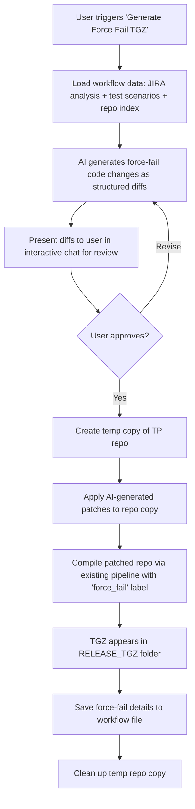
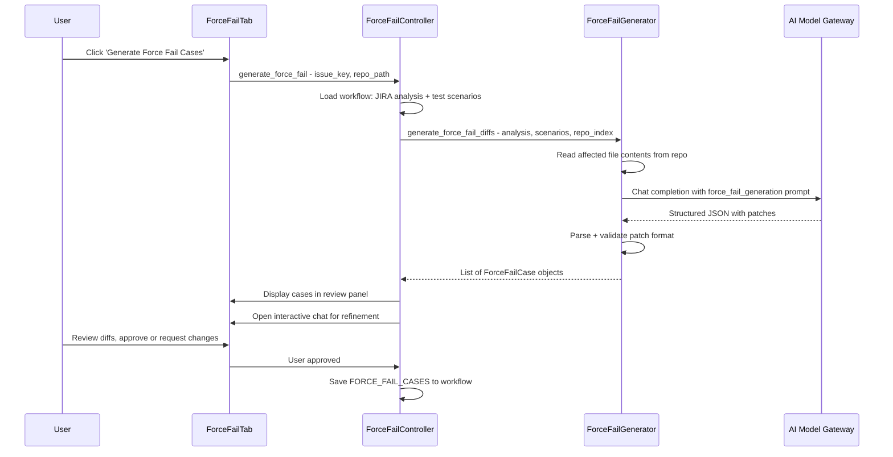
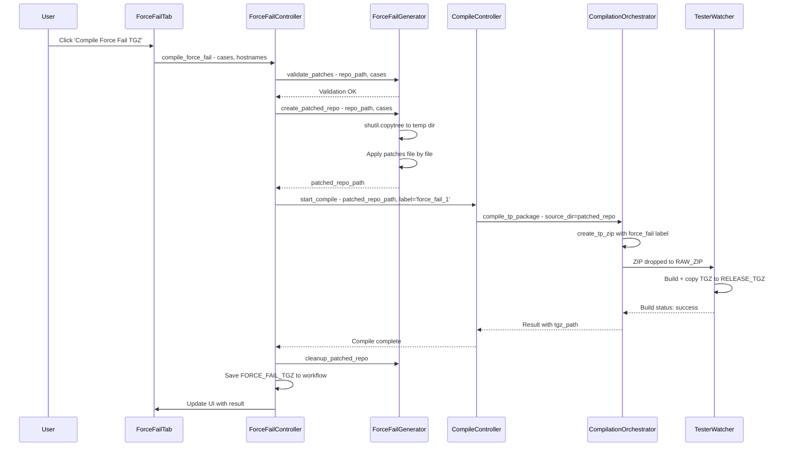

# AI-Generated Force Fail TGZ — Implementation Plan

## 1. Feature Overview

**Goal:** Automate the creation of force-fail TGZ packages by having the AI:
1. Analyze the JIRA change request + test scenarios to identify what should fail
2. Generate specific code changes (diffs) that will cause deliberate failures
3. Apply those changes to a **copy** of the TP repository
4. Compile the modified copy as a separate TGZ with a `force_fail` label
5. Produce both a `passing` TGZ and a `force_fail` TGZ in one workflow

This eliminates the manual effort of engineers modifying rule/limit/config files to create force-fail scenarios.

---

## 2. Architecture Context

The BENTO app follows an **MVC pattern**:

```
View (tabs)  →  Controller  →  Model (orchestrators + analyzers)
```

**Existing flow today:**
- AI generates test scenarios via `jira_analyzer.generate_test_scenarios()` — includes both PASSING and FORCE FAIL cases
- User manually creates force-fail code changes
- Compilation via `compilation_orchestrator.compile_tp_package()` — zips repo, drops to shared folder, watcher builds + returns TGZ
- Checkout tab already supports `passing` + `force_fail` test case labels

**What is missing:**
- AI does NOT generate actual code diffs for force-fail scenarios
- No automated repo-copy + patch + compile pipeline for force-fail
- No UI to trigger/review/approve AI-generated force-fail changes

---

## 3. End-to-End Flow



---

## 4. Component Breakdown

### 4.1 New AI Prompt: `force_fail_generation`

**File:** [`ai_modes.json`](ai_modes.json)

Add a new prompt template and mode specifically for force-fail code generation:

- **Input context:** JIRA analysis, test scenarios (specifically the FORCE FAIL cases), repo index, sample file contents from affected files
- **Output format:** Structured JSON containing an array of file patches:
  ```json
  {
    "force_fail_cases": [
      {
        "test_id": "FF-001",
        "description": "Force fail by setting invalid limit threshold",
        "rationale": "Validates that the new limit check catches out-of-range values",
        "patches": [
          {
            "file": "path/to/limits.py",
            "original_lines": ["threshold = 100"],
            "modified_lines": ["threshold = -1"],
            "line_number": 42
          }
        ]
      }
    ]
  }
  ```
- **System prompt:** Should instruct the AI to:
  - Know common force-fail patterns: invalid limits, wrong rule values, disabled checks, inverted conditions, out-of-range parameters
  - Analyze the specific test scenarios to determine what code changes would trigger the expected failures
  - Produce minimal, targeted changes — only modify what is needed to cause the specific failure
  - Never modify infrastructure/framework code — only test-specific logic
  - Output in the structured JSON format above so it can be programmatically applied

**New mode entry in `ai_modes.json`:**
- Key: `force_fail_generation`
- Name: "Force Fail Generator"
- System prompt: Specialized for SSD test engineering force-fail patterns
- Temperature: 0.3 (low — we want precise, deterministic changes)
- Task type: `code_generation`

### 4.2 New Model Layer: `ForceFailGenerator`

**New file:** `model/analyzers/force_fail_generator.py`

This is the core engine. Responsibilities:

1. **`generate_force_fail_diffs()`** — Calls the AI with the force-fail prompt
   - Inputs: JIRA analysis text, test scenarios text, repo index, contents of affected files
   - Reads affected file contents from the repo so the AI has full context
   - Calls `ai_client.chat_completion()` with the `force_fail_generation` mode
   - Parses the structured JSON response
   - Returns a list of `ForceFailCase` objects

2. **`create_patched_repo()`** — Creates a modified copy of the repo
   - Uses `shutil.copytree()` to clone the source repo to a temp directory
   - Applies each patch from the AI-generated diffs
   - Validates that patches applied cleanly (original lines match)
   - Returns the path to the patched repo

3. **`validate_patches()`** — Pre-flight check before applying
   - Verifies all target files exist in the repo
   - Verifies original_lines match the actual file content at the specified location
   - Returns validation result with any mismatches flagged

4. **`cleanup_patched_repo()`** — Removes the temp repo copy after compilation

**Data class:**
```
ForceFailCase:
  - test_id: str
  - description: str
  - rationale: str
  - patches: list of FilePatch

FilePatch:
  - file: str (relative path)
  - original_lines: list of str
  - modified_lines: list of str
  - line_number: int
```

### 4.3 New Controller: `ForceFailController`

**New file:** `controller/force_fail_controller.py`

Bridges the View and Model layers. Responsibilities:

1. **`generate_force_fail(issue_key, repo_path, callback)`**
   - Loads workflow data (JIRA analysis, test scenarios, repo index)
   - Calls `ForceFailGenerator.generate_force_fail_diffs()`
   - Opens interactive chat for user review (reuses existing chat pattern from `TestController`)
   - On approval, proceeds to patch + compile

2. **`compile_force_fail(issue_key, repo_path, force_fail_cases, hostnames, callback)`**
   - Calls `ForceFailGenerator.create_patched_repo()`
   - Delegates to `CompileController.start_compile()` with:
     - `source_dir` = patched repo path
     - `label` = `"force_fail_1"` (or per-case labels like `"force_fail_FF001"`)
   - On completion, calls `ForceFailGenerator.cleanup_patched_repo()`
   - Saves results to workflow file under `FORCE_FAIL_TGZ` step

3. **`generate_and_compile(issue_key, repo_path, hostnames, callback)`**
   - Convenience method that chains generate → review → compile
   - This is the "one-click" entry point from the UI

### 4.4 View Integration

**Modified file:** [`view/tabs/implementation_tab.py`](view/tabs/implementation_tab.py)

Two integration points:

#### Integrated into existing Compile sub-tab (Option B — selected)

Add a "Force Fail" section directly into the existing `"📦 TP Compilation & Health"` sub-tab. This keeps everything compilation-related in one place.

**UI additions to the compile sub-tab:**

1. **Force Fail Section** (new LabelFrame below the existing compile controls):
   - Checkbox: `☐ Include AI-generated force-fail TGZ`
   - When checked, reveals:
     - "Generate Force Fail Cases" button → triggers AI generation
     - Collapsible/expandable diff preview area (ScrolledText showing AI-generated patches)
     - Per-case checkboxes (user can select/deselect individual force-fail cases)
     - Status label showing generation state: `Not generated` / `Generated (3 cases)` / `Approved`

2. **Modified compile flow** when the checkbox is enabled:
   - Step 1: Compile the **passing** TGZ first (existing flow, unchanged)
   - Step 2: If force-fail cases are approved, automatically create patched repo copy
   - Step 3: Compile the **force-fail** TGZ using the patched repo
   - Step 4: Both TGZs appear in RELEASE_TGZ with distinct labels
   - The existing per-tester status badges show progress for both compilations

3. **Pre-compile validation:**
   - If "Include force-fail" is checked but cases are not yet generated/approved, show a warning dialog
   - User can either generate now, or uncheck and compile passing-only

4. **Compile button behavior change:**
   - When force-fail is enabled, the compile button text changes to "Compile Passing + Force Fail TGZs"
   - Progress shows two phases: "Phase 1/2: Compiling passing..." → "Phase 2/2: Compiling force-fail..."

#### Modified file: [`view/tabs/checkout_tab.py`](view/tabs/checkout_tab.py)

Minor enhancement — after force-fail TGZ is compiled, auto-populate the checkout tab's force-fail TGZ path so the user can immediately proceed to checkout with both passing and force-fail TGZs.

### 4.5 Workflow File Integration

**Modified file:** [`controller/workflow_controller.py`](controller/workflow_controller.py) (or wherever workflow steps are saved)

Add new workflow steps:
- `FORCE_FAIL_CASES` — The AI-generated force-fail case definitions (JSON)
- `FORCE_FAIL_DIFFS` — The actual code diffs that were applied
- `FORCE_FAIL_TGZ` — Path/name of the compiled force-fail TGZ
- `FORCE_FAIL_APPROVED` — Timestamp when user approved the diffs

This enables:
- Caching (don't regenerate if already done for this issue)
- Audit trail (what changes were made for the force-fail)
- Workflow file shows complete history

### 4.6 Settings Integration

**Modified file:** [`settings.json`](settings.json)

Add configuration under a new `force_fail` section:
```json
{
  "force_fail": {
    "temp_repo_prefix": "bento_ff_",
    "temp_repo_dir": "",
    "auto_cleanup": true,
    "max_patches_per_case": 10,
    "default_label_prefix": "force_fail"
  }
}
```

---

## 5. Detailed Interaction Flow

### 5.1 AI Generation Phase



### 5.2 Compilation Phase



---

## 6. AI Prompt Design Details

The force-fail generation prompt needs to be carefully designed. Key elements:

### Input Template
```
You are generating force-fail code changes for SSD test program validation.

**JIRA Change Request Analysis:**
{jira_analysis}

**Test Scenarios (Force Fail Cases):**
{force_fail_test_cases}

**Repository Structure:**
{repo_index_summary}

**Affected File Contents:**
{file_contents}

**Common Force-Fail Patterns:**
- Limit violations: Change threshold values to trigger out-of-range failures
- Rule inversions: Flip pass/fail conditions in rule files
- Config overrides: Set invalid configuration values
- Disabled checks: Comment out or bypass validation logic
- Wrong references: Point to non-existent FIDs, wrong product codes
- Boundary violations: Set values just outside acceptable ranges

**Instructions:**
1. For each force-fail test case listed above, generate the minimal code changes needed
2. Each change must be reversible and clearly documented
3. Only modify files directly related to the test scenario
4. Never modify framework/infrastructure code
5. Ensure changes will cause a DETECTABLE failure, not a silent one
6. Output in the structured JSON format specified below

**Output Format:**
Return a JSON object with this exact structure:
{output_schema}
```

### Output Validation
The generator must validate the AI response:
- JSON parses correctly
- All referenced files exist in the repo
- Original lines match actual file content (fuzzy match with whitespace tolerance)
- Modified lines are syntactically valid (basic check)
- No patches target excluded files (framework, infrastructure)

---

## 7. Error Handling and Safety

### 7.1 Patch Application Safety
- **Pre-validation:** Before copying the repo, verify all patches will apply cleanly
- **Atomic operation:** If any patch fails to apply, abort ALL patches and report which one failed
- **No modification of original repo:** All changes happen on the temp copy only
- **Temp directory naming:** Use `bento_ff_{jira_key}_{timestamp}` to avoid collisions

### 7.2 AI Response Safety
- **JSON parsing failure:** Show raw AI response to user, allow manual editing
- **File not found:** Flag the specific patch, allow user to skip or correct
- **Line mismatch:** Show expected vs actual content, allow user to adjust
- **Empty response:** Retry with more context or fall back to manual mode

### 7.3 Compilation Safety
- **Temp repo cleanup:** Always clean up, even on compile failure (use try/finally)
- **Label collision:** If a `force_fail` TGZ already exists for this JIRA key, warn user
- **Disk space:** Check available space before copying repo (repos can be large)

---

## 8. Files to Create/Modify

### New Files
| File | Purpose |
|------|---------|
| `model/analyzers/force_fail_generator.py` | Core engine: AI diff generation, repo patching, validation |
| `controller/force_fail_controller.py` | Controller bridging View and ForceFailGenerator |

### Modified Files
| File | Changes |
|------|---------|
| [`ai_modes.json`](ai_modes.json) | Add `force_fail_generation` prompt template and mode |
| [`view/tabs/implementation_tab.py`](view/tabs/implementation_tab.py) | Add Force Fail Generator sub-tab with UI |
| [`controller/bento_controller.py`](controller/bento_controller.py) | Wire up ForceFailController in the controller registry |
| [`settings.json`](settings.json) | Add `force_fail` configuration section |
| [`context.py`](context.py) | Add shared variables for force-fail state |
| [`main.py`](main.py) | Initialize ForceFailController during app startup |

### Optionally Modified
| File | Changes |
|------|---------|
| [`view/tabs/checkout_tab.py`](view/tabs/checkout_tab.py) | Auto-populate force-fail TGZ path after compilation |
| [`controller/full_workflow_controller.py`](controller/full_workflow_controller.py) | Add force-fail as optional step in full workflow |

---

## 9. Integration with Existing Patterns

This feature reuses several established BENTO patterns:

| Pattern | Existing Example | Reuse In Force Fail |
|---------|-----------------|---------------------|
| AI prompt + chat completion | [`jira_analyzer.generate_test_scenarios()`](model/analyzers/jira_analyzer.py:1518) | `ForceFailGenerator.generate_force_fail_diffs()` |
| Interactive chat for review | [`TestController.generate_tests()`](controller/test_controller.py:37) | User reviews AI-generated diffs before approval |
| Workflow caching | [`TestScenariosTab._generate_tests()`](view/tabs/test_scenarios_tab.py:75) | Cache force-fail cases in workflow file |
| Parallel compilation | [`CompileController.start_compile()`](controller/compile_controller.py:110) | Compile patched repo via same pipeline |
| Tester selection + badges | [`ImplementationTab._build_compile_tab()`](view/tabs/implementation_tab.py:44) | Reuse tester checkboxes and status badges |
| Label-based TGZ naming | [`watcher_copier.py`](model/watcher/watcher_copier.py:10) | `force_fail_1` label already supported |

---

## 10. Testing Strategy

### Unit Tests
- `ForceFailGenerator.validate_patches()` — test with valid/invalid patches
- `ForceFailGenerator.create_patched_repo()` — test patch application on a mock repo
- AI response parsing — test with various JSON formats, malformed responses

### Integration Tests
- End-to-end: generate diffs → patch repo → compile → verify TGZ has force-fail label
- Workflow caching: generate once, reload from cache on second run
- Error recovery: simulate patch failure mid-way, verify cleanup

### Manual Validation
- Run against a real JIRA issue with known force-fail scenarios
- Compare AI-generated force-fail changes against what an engineer would do manually
- Verify the compiled force-fail TGZ actually fails the expected test cases on a tester

---

## 11. Risk Assessment

| Risk | Likelihood | Impact | Mitigation |
|------|-----------|--------|------------|
| AI generates incorrect/dangerous code changes | Medium | High | Mandatory user review before compilation; never auto-apply without approval |
| Patch does not apply cleanly due to repo changes | Medium | Low | Pre-validation step; clear error messages showing expected vs actual |
| Temp repo copy consumes too much disk space | Low | Medium | Check disk space before copy; configurable temp directory; auto-cleanup |
| AI response format varies between calls | Medium | Medium | Strict JSON schema validation; retry logic; fallback to manual mode |
| Force-fail TGZ causes unexpected tester behavior | Low | High | Clear labeling; force-fail TGZ stored in separate subfolder; audit trail in workflow |
