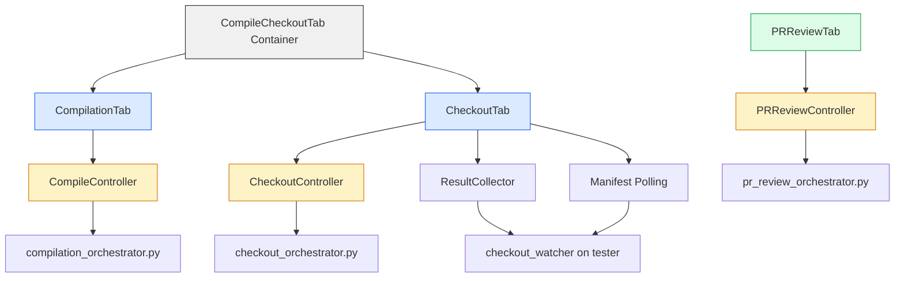
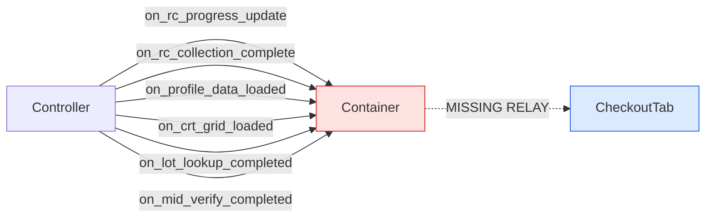

# Compile & Checkout + PR Review Tab — Improvement Plan

## Overview

After thorough review of all three tabs ([`compilation_tab.py`](view/tabs/compilation_tab.py), [`checkout_tab.py`](view/tabs/checkout_tab.py), [`pr_review_tab.py`](view/tabs/pr_review_tab.py)), the container ([`compile_checkout_tab.py`](view/tabs/compile_checkout_tab.py)), and their controllers, here are the identified improvements organized by priority.

---

## 🔴 HIGH PRIORITY — Bugs & Functional Issues  ✅ ALL DONE (commit ca4735c)

### 1. ✅ Duplicate `_ToolTip` class across tabs
- **Files**: [`compilation_tab.py:39-76`](view/tabs/compilation_tab.py:39), [`checkout_tab.py:43-80`](view/tabs/checkout_tab.py:43)
- **Problem**: Identical `_ToolTip` class is copy-pasted in both tabs. Any bug fix must be applied twice.
- **Fix**: Extract `_ToolTip` into a shared utility module (e.g., `view/widgets/tooltip.py`) and import from both tabs.

### 2. ✅ Compilation tab hardcoded repo path in health monitor
- **File**: [`compilation_tab.py:1106`](view/tabs/compilation_tab.py:1106)
- **Problem**: `repo_dir = r"C:\BENTO\adv_ibir_master"` is hardcoded. This won't work for testers with different repo paths.
- **Fix**: Read from the tester registry or use the selected tester's `repo_dir` field.

### 3. ✅ Compilation tab `_remove_tester()` uses display key instead of registry key
- **File**: [`compilation_tab.py:922-924`](view/tabs/compilation_tab.py:922)
- **Problem**: `_remove_tester()` tries to delete using the listbox display string (e.g., `"IBIR-0383 (ABIT)"`) as the registry key. If the registry was created with a different key format, deletion silently fails.
- **Fix**: Match by hostname+env fields inside the registry dict values, not by dict key.

### 4. ✅ PR Review tab missing mousewheel binding for scrollable canvas
- **File**: [`pr_review_tab.py:39-61`](view/tabs/pr_review_tab.py:39)
- **Problem**: The canvas is scrollable via scrollbar but has no mousewheel binding, unlike compilation and checkout tabs which both bind `<MouseWheel>`.
- **Fix**: Add `<Enter>`/`<Leave>` mousewheel bindings matching the pattern in compilation_tab.

### 5. ✅ PR Review tab `_auto_detect_validation_doc()` only searches CWD
- **File**: [`pr_review_tab.py:419-442`](view/tabs/pr_review_tab.py:419)
- **Problem**: Only checks `os.path.exists(candidate)` which searches the current working directory. Should also search the workflow output folder and the repo path.
- **Fix**: Add the workflow output directory and repo path to the search candidates.

### 6. ✅ `CompileCheckoutTab` missing relay for result collection callbacks
- **File**: [`compile_checkout_tab.py:58-90`](view/tabs/compile_checkout_tab.py:58)
- **Problem**: The container relays `on_checkout_completed`, `on_checkout_progress`, etc., but does NOT relay `on_rc_progress_update`, `on_rc_collection_complete`, `on_profile_data_loaded`, or `on_crt_grid_loaded`. If the main controller routes through the container, these callbacks will be silently dropped.
- **Fix**: Add relay methods for all checkout sub-tab callbacks.

---

## 🟡 MEDIUM PRIORITY — UX & Usability  ✅ Items 8-13 DONE (commit 19305c6)

### 7. Compilation tab: no progress indicator during compile
- **File**: [`compilation_tab.py:983-1041`](view/tabs/compilation_tab.py:983)
- **Problem**: During compilation, only the button text changes to "⏳ Compiling..." — there's no progress bar or elapsed timer. For long compiles, the user has no feedback.
- **Fix**: Add an indeterminate progress bar (like checkout tab's `_checkout_progress`) and an elapsed-time label that updates every second.

### 8. ✅ Compilation tab: health monitor auto-refresh runs forever
- **File**: [`compilation_tab.py:1221`](view/tabs/compilation_tab.py:1221)
- **Problem**: `self.after(30000, self._refresh_health)` runs unconditionally every 30s even when the tab is not visible. This wastes resources and can cause errors if the widget is destroyed.
- **Fix**: Added `_schedule_health_refresh()` that checks tab visibility via `parent_nb.select()` before scheduling the next refresh.

### 9. ✅ Checkout tab: `_stop_checkout()` transitions STOPPING → IDLE instantly
- **File**: [`checkout_tab.py:1603-1618`](view/tabs/checkout_tab.py:1603)
- **Problem**: After setting `STOPPING`, it immediately sets `IDLE`. The STOPPING state is never visible to the user.
- **Fix**: Replaced instant IDLE with `self.after(5000, self._stop_fallback_to_idle)` — a 5s timeout that only fires if the completion callback hasn't already moved the state.

### 10. ✅ Checkout tab: manifest poll guard allows IDLE state
- **File**: [`checkout_tab.py:2658-2662`](view/tabs/checkout_tab.py:2658)
- **Problem**: `_poll_for_manifest()` continues polling when state is `IDLE`, which means it keeps running even after the user clicks Stop.
- **Fix**: Removed `CheckoutState.IDLE` from the guard's allowed states. Only `COMPLETED` and `COLLECTING` continue polling.

### 11. ✅ PR Review tab: no status log clear button
- **File**: [`pr_review_tab.py:260-270`](view/tabs/pr_review_tab.py:260)
- **Problem**: The status log (`ScrolledText`) accumulates text across multiple pipeline runs with no way to clear it.
- **Fix**: Added "🗑 Clear Log" button in a header row above the status log, with `_clear_status_log()` method.

### 12. ✅ PR Review tab: commit message not auto-populated from JIRA
- **File**: [`pr_review_tab.py:35-48`](view/tabs/pr_review_tab.py:35)
- **Problem**: The commit message field starts empty. The user must type it manually every time.
- **Fix**: Added `trace_add('write')` on `issue_var` that auto-populates `[{JIRA_KEY}] Validation updates` when the field is empty or matches the auto pattern.

### 13. ✅ Compilation tab: `_open_release_folder()` double-click opens wrong folder
- **File**: [`compilation_tab.py:1309-1380`](view/tabs/compilation_tab.py:1309)
- **Problem**: Double-click on history row tries to match by `{tester}_{jira_key}_{env}` folder name which may not match the actual folder.
- **Fix**: Now uses Output TGZ path from the tree row (Strategy 1: derive from TGZ path, Strategy 2: fuzzy match by tester+jira in folder name).

---

## 🟢 LOW PRIORITY — Code Quality & Polish

### 14. Compilation tab: duplicate `import` statements inside methods
- **File**: [`compilation_tab.py`](view/tabs/compilation_tab.py) — lines 883, 898, 913, 935, 1099, 1236, 1291, 1345
- **Problem**: `import os`, `import json`, `import datetime`, `import threading` are imported inside multiple methods instead of at the top of the file.
- **Fix**: Move all standard library imports to the top-level import block.

### 15. PR Review tab: phase indicator doesn't mark completed phases on error
- **File**: [`pr_review_tab.py:456-489`](view/tabs/pr_review_tab.py:456)
- **Problem**: When the pipeline fails, completed phases stay as 🔄 (in-progress) instead of being marked ✅. Only the `_on_phase_update` callback marks phases, but on failure the final phase stays as 🔄.
- **Fix**: In `_on_pipeline_complete()`, mark all completed phases as ✅ and the failed phase as ❌.

### 16. PR Review tab: reviewers field should support autocomplete
- **File**: [`pr_review_tab.py:107-116`](view/tabs/pr_review_tab.py:107)
- **Problem**: Reviewers must be typed manually as comma-separated Bitbucket usernames. Users may not remember exact usernames.
- **Fix**: Add a dropdown/autocomplete that loads reviewer names from a config file or Bitbucket API.

### 17. Checkout tab: `_rc_auto_start_monitoring()` uses hardcoded `name_str = dut`
- **File**: [`checkout_tab.py:2458`](view/tabs/checkout_tab.py:2458)
- **Problem**: `name_str = dut if dut else mid` — the "name" column in MIDs.txt is set to the DUT number, which is not meaningful. Should use a descriptive name.
- **Fix**: Use the MID serial or a combination of lot+MID as the name field.

### 18. Compilation tab: `_save_tester_registry()` reconstructs from listbox with hardcoded defaults
- **File**: [`compilation_tab.py:941-954`](view/tabs/compilation_tab.py:941)
- **Problem**: When `registry_data is None`, it reconstructs from the listbox with hardcoded `repo_dir` and `build_cmd`. This loses the original values.
- **Fix**: Always pass explicit `registry_data` to `_save_tester_registry()`. Remove the listbox reconstruction fallback.

### 19. Add "Copy to Clipboard" for compile history rows
- **File**: [`compilation_tab.py:386-416`](view/tabs/compilation_tab.py:386)
- **Problem**: No way to copy compile history details (timestamp, status, TGZ path) to clipboard for sharing.
- **Fix**: Add right-click context menu with "Copy Row" option.

### 20. PR Review tab: no link to open PR in browser
- **File**: [`pr_review_tab.py:255-268`](view/tabs/pr_review_tab.py:255)
- **Problem**: PR URL is shown in a readonly entry with a copy button, but there's no "Open in Browser" button.
- **Fix**: Add a "🌐 Open" button that calls `webbrowser.open(url)`.

---

## Architecture Diagram

---

## Missing Relay Methods in CompileCheckoutTab

---

## Summary

| Priority | Count | Category |
|----------|-------|----------|
| 🔴 High | 6 | Bugs, functional issues, missing relays |
| 🟡 Medium | 7 | UX gaps, state machine issues, missing features |
| 🟢 Low | 7 | Code quality, polish, nice-to-haves |
| **Total** | **20** | |
