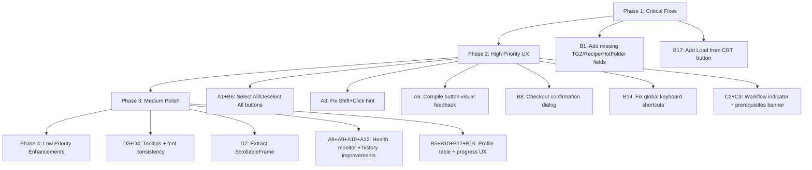

# Compile & Checkout Tab — UX Improvement Plan

## Overview

This document lists all identified UX/UI issues and improvement opportunities across the three files that make up the **⚙️ Compile & Checkout** tab:

| File | Role |
|------|------|
| [`compile_checkout_tab.py`](view/tabs/compile_checkout_tab.py) | Parent container with nested sub-tabs |
| [`compilation_tab.py`](view/tabs/compilation_tab.py) | 📦 TP Compilation sub-tab |
| [`checkout_tab.py`](view/tabs/checkout_tab.py) | 🧪 Checkout sub-tab |

---

## A. COMPILATION TAB — Issues & Improvements

### A1. Tester Listbox — Poor Multi-Select UX
**File:** [`compilation_tab.py:118`](view/tabs/compilation_tab.py:118)
- **Issue:** Uses `tk.Listbox` with `selectmode=tk.MULTIPLE` and `height=3` — only 3 items visible at a time, no "Select All / Deselect All" buttons.
- **Fix:** Add "Select All" / "Deselect All" buttons next to the existing "+ Add Tester" / "🗑 Remove" buttons. Increase default `height` to 5 or make it dynamic based on tester count.

### A2. Search Placeholder Text — Fragile Implementation
**File:** [`compilation_tab.py:110-113`](view/tabs/compilation_tab.py:110)
- **Issue:** Placeholder "Search..." is implemented via manual insert/delete on FocusIn/FocusOut with `foreground="gray"`. If user types and then clears, the placeholder doesn't restore properly. The `_filter_testers` method also has to check for `"search..."` string.
- **Fix:** Use a proper placeholder pattern — bind to `<FocusIn>` and `<FocusOut>` with a flag, or use a custom `PlaceholderEntry` widget class. Ensure the search text color resets to normal on focus-in.

### A3. Shift+Click Hint — Misleading
**File:** [`compilation_tab.py:114`](view/tabs/compilation_tab.py:114)
- **Issue:** Label says "(Shift+Click for multi)" but `tk.Listbox` with `MULTIPLE` selectmode doesn't require Shift — every click toggles. This hint is misleading.
- **Fix:** Change to "(Click to toggle selection)" or remove the hint entirely.

### A4. Configuration & Paths — Entry Widths Too Narrow
**File:** [`compilation_tab.py:144-167`](view/tabs/compilation_tab.py:144)
- **Issue:** TGZ Label entry is `width=22`, RAW_ZIP and RELEASE_TGZ entries are `width=28`. These paths can be very long (e.g., `P:\temp\BENTO\RAW_ZIP`) and get truncated.
- **Fix:** Make path entries expand with the window by using `sticky="we"` and removing fixed widths, or increase to `width=50+`.

### A5. Compile Button — No Visual Feedback During Compilation
**File:** [`compilation_tab.py:177-181`](view/tabs/compilation_tab.py:177)
- **Issue:** The compile button text stays as "🚀 Compile on Selected Tester(s)" during compilation. Only a small status label below shows "Running...". Users may not notice.
- **Fix:** Change button text to "⏳ Compiling..." during operation, and/or add a progress bar. Consider adding an animated spinner or pulsing indicator.

### A6. Force Fail Section — Deeply Nested, Hard to Discover
**File:** [`compilation_tab.py:276-365`](view/tabs/compilation_tab.py:276)
- **Issue:** The Force Fail TGZ section is nested inside the "Compile TP Package" LabelFrame (row=2), making it visually subordinate. Users may not realize it's a separate workflow.
- **Fix:** Move Force Fail to its own top-level LabelFrame at the same level as "Compile TP Package" and "Watcher Health Monitor", or add a visual separator with a distinct header.

### A7. Force Fail Cases — Double-Click to Toggle is Not Discoverable
**File:** [`compilation_tab.py:338`](view/tabs/compilation_tab.py:338)
- **Issue:** Toggling force-fail cases requires double-clicking a row. There's no visual hint or instruction telling users this.
- **Fix:** Add a small instruction label: "Double-click a row to enable/disable" or add an explicit toggle button in the toolbar.

### A8. Watcher Health Monitor — No Auto-Refresh Indicator
**File:** [`compilation_tab.py:189-226`](view/tabs/compilation_tab.py:189)
- **Issue:** Health monitor auto-refreshes every 30 seconds (`self.after(30000, self._refresh_health)`) but there's no visual indicator showing when the last refresh occurred or that auto-refresh is active.
- **Fix:** Add a "Last refreshed: HH:MM:SS" label next to the "🔄 Refresh Now" button.

### A9. Recent Builds — Limited to 3 Entries, No Scrollbar
**File:** [`compilation_tab.py:214-215`](view/tabs/compilation_tab.py:214)
- **Issue:** `builds_text` is a `tk.Text` with `height=6` showing max 3 builds (2 lines each). No scrollbar, and the widget is set to `relief="flat"` making it look like a label rather than a scrollable area.
- **Fix:** Add a vertical scrollbar, increase to 5 recent builds, and add a subtle border (`relief="sunken"` or `"groove"`) to indicate it's a scrollable area.

### A10. Compile History — Treeview Height Too Small
**File:** [`compilation_tab.py:246`](view/tabs/compilation_tab.py:246)
- **Issue:** History treeview has `height=4` — only 4 rows visible. For a history section that can have 100 entries, this is too small.
- **Fix:** Increase to `height=8` or make it expand with `fill=tk.BOTH, expand=True`.

### A11. Compile History — No Sorting
**File:** [`compilation_tab.py:245-252`](view/tabs/compilation_tab.py:245)
- **Issue:** Column headings are not clickable for sorting. Users can't sort by timestamp, JIRA key, tester, etc.
- **Fix:** Add click-to-sort on column headings with ascending/descending toggle.

### A12. Compile History — No Status Column
**File:** [`compilation_tab.py:245`](view/tabs/compilation_tab.py:245)
- **Issue:** Columns are `("Timestamp", "JIRA", "Tester", "ENV", "Label", "Output TGZ")` — there's no "Status" column showing SUCCESS/FAILED. Users can't quickly see which compilations succeeded.
- **Fix:** Add a "Status" column with color-coded text (green for SUCCESS, red for FAILED).

### A13. Add Tester Dialog — Too Tall, Wasted Space
**File:** [`compilation_tab.py:1127-1296`](view/tabs/compilation_tab.py:1127)
- **Issue:** Dialog is `560x640` with `resizable(False, False)`. The preflight checklist takes significant space. The dialog feels oversized for 4 input fields.
- **Fix:** Reduce dialog height, make the preflight checklist collapsible, or move it to a tooltip/info panel. Allow resizing.

### A14. Add Tester Dialog — No Input Validation Feedback
**File:** [`compilation_tab.py:1260-1295`](view/tabs/compilation_tab.py:1260)
- **Issue:** Only validates hostname is non-empty and checks for duplicates. No format validation (e.g., hostname pattern like `IBIR-XXXX`). Error shown in a tiny label at the bottom.
- **Fix:** Add real-time validation with visual indicators (green checkmark / red X next to each field). Validate hostname format.

### A15. Two-Column Layout Cramped on Small Screens
**File:** [`compilation_tab.py:93-101`](view/tabs/compilation_tab.py:93)
- **Issue:** "Target Testers" and "Configuration & Paths" are side-by-side in a 2-column grid. On smaller screens or when the window is narrow, both columns get squeezed.
- **Fix:** Consider a responsive layout that stacks vertically when the window is narrow, or use a minimum width constraint.

---

## B. CHECKOUT TAB — Issues & Improvements

### B1. Missing TGZ Path & Hot Folder Fields
**File:** [`checkout_tab.py:387-460`](view/tabs/checkout_tab.py:387)
- **Issue:** The "Checkout Paths & Test Cases" section builds a `frm` with 3-column grid but only shows: options row (Generate TempTraveler, Auto Start) and TC row (PASS/FAIL checkboxes + labels). The **TGZ path**, **Recipe override**, and **Hot Folder** fields mentioned in the docstring (lines 82-87) are **missing from the UI**. They exist as variables (`checkout_tgz_path`, `checkout_recipe_override`, `checkout_hot_folder`) but have no visible input widgets.
- **Fix:** Add the missing TGZ path (with Browse button), Recipe override (with Scan TGZ button), and Hot Folder (with Browse button) input rows to the paths section.

### B2. Profile Table — No Right-Click Context Menu
**File:** [`checkout_tab.py:333-361`](view/tabs/checkout_tab.py:333)
- **Issue:** The profile grid only supports double-click for editing. No right-click context menu for common actions (copy row, paste, duplicate row, move up/down).
- **Fix:** Add a right-click context menu with: Edit Cell, Duplicate Row, Delete Row, Move Up, Move Down, Copy Row, Paste Row.

### B3. Profile Table — No Drag-and-Drop Row Reordering
**File:** [`checkout_tab.py:333`](view/tabs/checkout_tab.py:333)
- **Issue:** Rows can only be added/removed, not reordered. Users must delete and re-add to change order.
- **Fix:** Implement drag-and-drop row reordering or add Move Up/Move Down buttons.

### B4. Profile Table — No Column Resize Persistence
**File:** [`checkout_tab.py:345-346`](view/tabs/checkout_tab.py:345)
- **Issue:** Columns use `stretch=False` with fixed widths. Users can't resize columns, and the total width of all columns (1395px) may exceed the window width.
- **Fix:** Allow column resizing and persist user preferences. Consider making some columns stretchable.

### B5. Profile Table — 14 Columns is Overwhelming
**File:** [`checkout_tab.py:108-123`](view/tabs/checkout_tab.py:108)
- **Issue:** 14 columns in a single treeview is a lot of horizontal scrolling. Many columns (DIB_TYPE, MACHINE_MODEL, MACHINE_VENDOR) are auto-populated and rarely edited manually.
- **Fix:** Consider grouping columns or allowing users to show/hide columns. Add a "Show Advanced Columns" toggle that hides auto-populated hardware columns by default.

### B6. Tester Selection — Checkboxes Instead of Listbox
**File:** [`checkout_tab.py:953-973`](view/tabs/checkout_tab.py:953)
- **Issue:** Uses individual checkboxes for each tester. This is fine for a few testers but doesn't scale well. No "Select All" / "Deselect All" buttons visible.
- **Fix:** Add "Select All" / "Deselect All" buttons. Consider using a Listbox with checkmarks for better scalability.

### B7. Tester Selection — No Badge Legend
**File:** [`checkout_tab.py:92-104`](view/tabs/checkout_tab.py:92)
- **Issue:** Badge colors (IDLE, PENDING, RUNNING, etc.) are used but there's no legend explaining what each color means.
- **Fix:** Add a small color legend or tooltip explaining badge states.

### B8. Action Buttons — No Confirmation Before Start
**File:** [`checkout_tab.py:496-516`](view/tabs/checkout_tab.py:496)
- **Issue:** "▶ Start Checkout" immediately starts the checkout process without a confirmation dialog. This is a potentially long-running operation that deploys to testers.
- **Fix:** Add a confirmation dialog summarizing what will happen: number of testers, test cases, MIDs, estimated time.

### B9. Action Buttons — Stop Button Always Visible but Disabled
**File:** [`checkout_tab.py:511-515`](view/tabs/checkout_tab.py:511)
- **Issue:** The Stop button is always visible but disabled. It takes up space when not needed.
- **Fix:** Hide the Stop button when not running, or use a single button that toggles between Start/Stop.

### B10. Test Progress Section — No Progress Bar
**File:** [`checkout_tab.py:1573-1658`](view/tabs/checkout_tab.py:1573)
- **Issue:** The test progress section shows a treeview with MID statuses but no overall progress bar showing completion percentage.
- **Fix:** Add a progress bar above the treeview showing `completed / total` MIDs.

### B11. Test Progress — Treeview Height Too Small
**File:** [`checkout_tab.py:1628`](view/tabs/checkout_tab.py:1628)
- **Issue:** `height=5` — only 5 rows visible. If there are many MIDs, users must scroll.
- **Fix:** Increase to `height=8` or make it expand dynamically.

### B12. Inline Editing — No Visual Indicator of Editable Cells
**File:** [`checkout_tab.py:712-768`](view/tabs/checkout_tab.py:712)
- **Issue:** Users must know to double-click to edit. There's no visual distinction between editable and read-only cells. The tooltip mentions it but tooltips are easily missed.
- **Fix:** Use a different background color or cursor change on hover for editable cells. Add a small "✏️" icon or pencil cursor.

### B13. ATTR_OVERWRITE Dialog — Complex but No Help Text
**File:** [`checkout_tab.py:770-882`](view/tabs/checkout_tab.py:770)
- **Issue:** The ATTR_OVERWRITE editor dialog has Section/Attr Name/Attr Value fields but no examples or help text explaining what valid values look like.
- **Fix:** Add example text or a help link. Show placeholder text in the entry fields (e.g., "MAM", "ATTR_NAME", "value").

### B14. Keyboard Shortcuts — Global Bindings Conflict Risk
**File:** [`checkout_tab.py:275-276`](view/tabs/checkout_tab.py:275)
- **Issue:** `bind_all("<Control-Return>")` and `bind_all("<Control-i>")` are global bindings that will fire even when the user is on a different tab. Ctrl+I could conflict with other functionality.
- **Fix:** Use tab-specific bindings instead of `bind_all`. Only activate shortcuts when the Checkout tab is visible.

### B15. File Selection Dialog — No File Size Summary
**File:** [`checkout_tab.py:1946-2098`](view/tabs/checkout_tab.py:1946)
- **Issue:** Individual file sizes are shown but there's no total size summary at the bottom showing "Total selected: X.X MB".
- **Fix:** Add a dynamic total size label that updates as checkboxes are toggled.

### B16. No Validation Feedback Before Checkout
**File:** [`checkout_tab.py:1052-1179`](view/tabs/checkout_tab.py:1052)
- **Issue:** Validation errors are shown as a single error dialog listing all issues. Users must fix issues and try again with no inline guidance.
- **Fix:** Add real-time validation indicators next to each field (red border / green checkmark). Show a pre-flight checklist panel before starting.

### B17. CRT Load Button Referenced but Not Visible
**File:** [`checkout_tab.py:702-706`](view/tabs/checkout_tab.py:702)
- **Issue:** `_profile_load_from_crt()` method exists but there's no button in the toolbar calling it. The docstring mentions "Load from CRT" but it's not in the UI.
- **Fix:** Add a "Load from CRT" button to the profile toolbar, or remove the dead code.

### B18. No Undo/Redo for Profile Table Edits
**File:** [`checkout_tab.py:534-612`](view/tabs/checkout_tab.py:534)
- **Issue:** Profile table edits (add row, remove row, inline edit) have no undo/redo capability. Accidental deletions are permanent.
- **Fix:** Implement a simple undo stack for profile table operations.

---

## C. COMPILE & CHECKOUT CONTAINER — Issues & Improvements

### C1. Nested Tabs — Extra Click Depth
**File:** [`compile_checkout_tab.py:38-39`](view/tabs/compile_checkout_tab.py:38)
- **Issue:** The parent tab "⚙️ Compile & Checkout" contains a nested notebook with two sub-tabs. This adds an extra level of navigation. Users must click the parent tab, then the sub-tab.
- **Fix:** Consider whether the nested structure is necessary. If both sub-tabs are frequently used, keep them. If one is primary, consider making it the default view with a toggle for the other.

### C2. No Visual Connection Between Compile and Checkout
**File:** [`compile_checkout_tab.py:46-47`](view/tabs/compile_checkout_tab.py:46)
- **Issue:** Compile and Checkout are separate sub-tabs with no workflow indicator showing the relationship (Compile → Checkout). Users may not realize they should compile first, then checkout.
- **Fix:** Add a workflow indicator or breadcrumb at the top: "Step 1: Compile → Step 2: Checkout". Or add a "Proceed to Checkout" button at the bottom of the Compilation tab.

### C3. No Shared State Indicator
**File:** [`compile_checkout_tab.py:27-30`](view/tabs/compile_checkout_tab.py:27)
- **Issue:** Both tabs depend on shared context variables (issue_var, impl_repo_var) set in other tabs (Home, Implementation). There's no indicator showing whether prerequisites are met.
- **Fix:** Add a prerequisites banner at the top of each sub-tab showing: "JIRA: TSESSD-14270 ✓ | Repo: C:\BENTO\... ✓ | TGZ: ✗ not set"

---

## D. CROSS-CUTTING CONCERNS

### D1. Inconsistent Tester Selection Between Tabs
- **Issue:** Compilation tab uses a `tk.Listbox` with multi-select for testers. Checkout tab uses individual `ttk.Checkbutton` widgets. Different UX patterns for the same concept.
- **Fix:** Standardize on one pattern. Checkboxes are more explicit; Listbox is more compact. Pick one and use it consistently.

### D2. No Loading/Spinner Indicators
- **Issue:** Long-running operations (compile, checkout, lot lookup, MID verify) show text status but no visual spinner or progress indicator.
- **Fix:** Add a spinning indicator or indeterminate progress bar during async operations.

### D3. No Tooltips on Most Buttons (Compilation Tab)
- **Issue:** The Checkout tab uses `_tip()` extensively for tooltips. The Compilation tab has zero tooltips on any button.
- **Fix:** Add tooltips to all buttons in the Compilation tab matching the Checkout tab's pattern.

### D4. Font Inconsistency
- **Issue:** Mixed font usage: `"Arial"` in Compilation tab, `"Segoe UI"` in Checkout tab. Font sizes vary (8, 9, 10, 12).
- **Fix:** Standardize on `"Segoe UI"` throughout (Windows default) with consistent size tiers: 8 for hints, 9 for body, 10 for section headers, 12 for dialog titles.

### D5. Color Inconsistency
- **Issue:** Status colors are defined differently:
  - Compilation: `_BADGE_COLOURS` with 6 states
  - Checkout: `_BADGE_COLOURS` with 11 states
  - Various hardcoded colors throughout (`#cc0000`, `#1a6e1a`, `#0066cc`, etc.)
- **Fix:** Create a shared color constants module and use it consistently.

### D6. No Dark Mode Support
- **Issue:** All colors are hardcoded for light theme. `tk.Text` widgets use `bg="white"`.
- **Fix:** Use ttk theme colors where possible. For custom colors, create a theme-aware color resolver.

### D7. Scrollable Canvas Pattern Duplicated
- **Issue:** Both [`compilation_tab.py:50-87`](view/tabs/compilation_tab.py:50) and [`checkout_tab.py:223-265`](view/tabs/checkout_tab.py:223) have identical scrollable canvas boilerplate (~40 lines each).
- **Fix:** Extract into a reusable `ScrollableFrame` widget in [`base_tab.py`](view/tabs/base_tab.py) or a shared utility module.

### D8. No Keyboard Navigation
- **Issue:** No keyboard shortcuts for common actions in the Compilation tab. Tab order may not be logical.
- **Fix:** Add keyboard shortcuts (e.g., Ctrl+Enter to compile, Ctrl+R to refresh). Ensure logical tab order.

---

## E. PRIORITY RANKING

| Priority | ID | Description |
|----------|----|-------------|
| 🔴 Critical | B1 | Missing TGZ Path, Recipe, Hot Folder fields in Checkout |
| 🔴 Critical | B17 | CRT Load button missing from UI |
| 🟠 High | A1 | Tester Listbox needs Select All/Deselect All |
| 🟠 High | A3 | Misleading Shift+Click hint |
| 🟠 High | A5 | No visual feedback during compilation |
| 🟠 High | B6 | Tester Selection needs Select All/Deselect All |
| 🟠 High | B8 | No confirmation before starting checkout |
| 🟠 High | B14 | Global keyboard shortcuts conflict risk |
| 🟠 High | C2 | No workflow indicator between Compile → Checkout |
| 🟠 High | C3 | No shared state / prerequisites indicator |
| 🟡 Medium | A2 | Search placeholder fragile implementation |
| 🟡 Medium | A4 | Path entry widths too narrow |
| 🟡 Medium | A7 | Force Fail double-click not discoverable |
| 🟡 Medium | A8 | No auto-refresh timestamp indicator |
| 🟡 Medium | A9 | Recent Builds limited, no scrollbar |
| 🟡 Medium | A10 | Compile History treeview too small |
| 🟡 Medium | A12 | No Status column in Compile History |
| 🟡 Medium | B5 | 14 columns overwhelming — add show/hide |
| 🟡 Medium | B10 | No progress bar in Test Progress |
| 🟡 Medium | B12 | No visual indicator of editable cells |
| 🟡 Medium | B16 | No inline validation feedback |
| 🟡 Medium | D1 | Inconsistent tester selection UX |
| 🟡 Medium | D2 | No loading spinners |
| 🟡 Medium | D3 | Missing tooltips in Compilation tab |
| 🟡 Medium | D4 | Font inconsistency |
| 🟡 Medium | D7 | Duplicated scrollable canvas code |
| 🟢 Low | A6 | Force Fail section deeply nested |
| 🟢 Low | A11 | No column sorting in history |
| 🟢 Low | A13 | Add Tester dialog too tall |
| 🟢 Low | A14 | No hostname format validation |
| 🟢 Low | A15 | Two-column layout cramped on small screens |
| 🟢 Low | B2 | No right-click context menu |
| 🟢 Low | B3 | No drag-and-drop row reordering |
| 🟢 Low | B4 | No column resize persistence |
| 🟢 Low | B7 | No badge color legend |
| 🟢 Low | B9 | Stop button always visible |
| 🟢 Low | B11 | Test Progress treeview too small |
| 🟢 Low | B13 | ATTR_OVERWRITE dialog no help text |
| 🟢 Low | B15 | File Selection dialog no total size |
| 🟢 Low | B18 | No undo/redo for profile edits |
| 🟢 Low | C1 | Nested tabs extra click depth |
| 🟢 Low | D5 | Color inconsistency |
| 🟢 Low | D6 | No dark mode support |
| 🟢 Low | D8 | No keyboard navigation in Compilation tab |

---

## F. RECOMMENDED IMPLEMENTATION ORDER

---

## G. SUMMARY

**Total issues identified: 40**

| Category | Count |
|----------|-------|
| 🔴 Critical | 2 |
| 🟠 High | 8 |
| 🟡 Medium | 15 |
| 🟢 Low | 15 |

The two critical issues (B1 and B17) represent **missing UI elements** — the TGZ path, recipe override, and hot folder fields exist as variables but have no visible widgets, and the "Load from CRT" button is referenced in code but never rendered. These should be fixed first as they represent broken functionality.
