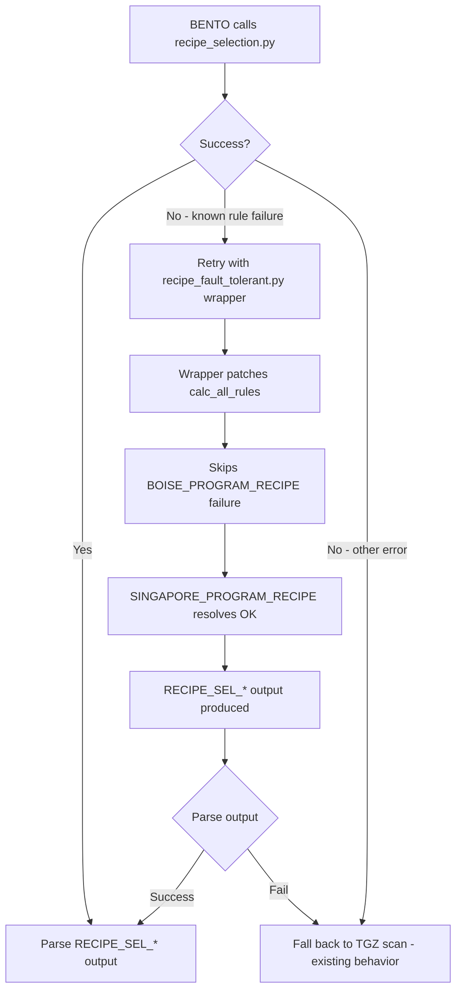

# Fix Recipe Selection Subprocess — Make It Succeed Without TGZ Fallback

## Problem Summary

The external `recipe_selection.py` subprocess crashes with:
```
ValueError: Hit the end of the table when looking up the value for rule BOISE_PROGRAM_RECIPE
```

This prevents the subprocess from producing `RECIPE_SEL_*` output lines, forcing BENTO to fall back to the less reliable TGZ scan.

## Root Cause

### The Rule Engine's Eager Evaluation

The rule engine in `attributes.py` has a `calc_all_rules()` method that **eagerly resolves every rule** in the pickle file:

```python
def calc_all_rules(self):
    all_rules = self.keys()
    for rule in all_rules:
        self[rule]  # resolves each rule via __getitem__
```

### The Site-Specific Rule Tables

The `rsel_IBIR.rul` file defines **site-specific** recipe rules:

| Rule | Site | Has entries for our product? |
|------|------|------------------------------|
| `BOISE_PROGRAM_RECIPE` | BOISE | Only `MKT_SEGMENT=1300` — **NO** match for 6550_ION etc. |
| `SINGAPORE_PROGRAM_RECIPE` | SINGAPORE | Has entries for most products — **WOULD** match |
| `PENANG_PROGRAM_RECIPE` | PENANG | Has entries for most products |
| `SANAND_PROGRAM_RECIPE` | SANAND | Has entries for most products |

The `TEST_PROGRAM_PATH` rule selects which site-specific rule to use based on `SITE_NAME`:

```
TEST_PROGRAM_PATH:     PROGRAM_RECIPE:             SITE_NAME?    NamedProduct?
BOISE_JOBPATH          BOISE_PROGRAM_RECIPE        ['BOISE']     ~
SINGAPORE_JOBPATH      SINGAPORE_PROGRAM_RECIPE    ['SINGAPORE'] ~
PENANG_JOBPATH         PENANG_PROGRAM_RECIPE       ['PENANG']    ~
```

**The problem:** Even though `SITE_NAME=SINGAPORE`, `calc_all_rules()` resolves ALL rules including `BOISE_PROGRAM_RECIPE`. Since `BOISE_PROGRAM_RECIPE` only has a row for `MKT_SEGMENT=1300`, any other product hits the `ERROR` catch-all, which then cascades to crash the entire subprocess.

### Why This Works in Production CAT

In production CAT at Boise, `SITE_NAME=BOISE` and the products tested there are limited to those with `BOISE_PROGRAM_RECIPE` entries. At Singapore, the same products have `SINGAPORE_PROGRAM_RECIPE` entries. The issue is that `calc_all_rules()` tries to resolve rules for ALL sites, not just the current one.

This is actually a **latent bug in the upstream recipe_selection.py** — it works in production only because the product mix at each site happens to have matching entries in that site's rule table. When BENTO runs from Singapore with a product that Boise doesn't support, it crashes.

---

## Recommended Approach: Patch the Tmptravl to Pre-Resolve Irrelevant Site Rules

### How It Works

The `SSDrules_loader.py` loads tmptravl attributes into the solutions dict. When a tmptravl attribute name matches a rule name, the tmptravl value is stored in `rule_tmptravl_conflicts` but the rule definition remains. However, if we add the rule name as a **new tmptravl attribute** that doesn't conflict with an existing rule, it gets added as a pre-resolved value:

```python
solutions[key] = ((), [((),repr(val))])  # force evaluate
```

**Wait — this won't work** because `BOISE_PROGRAM_RECIPE` IS already defined as a rule. The conflict handler stores it separately but doesn't override the rule.

### Revised Approach: Patch the Tmptravl File After Generation

Instead of trying to inject into the tmptravl dict, we **patch the generated tmptravl .dat file** to add dummy values for site-irrelevant rules in a new section that the rule engine will pick up. But this is fragile.

### BEST Approach: Two-Pass Strategy with Error Recovery

Since we can't modify the external `recipe_selection.py` or its rule files, the best approach is:

1. **First attempt:** Run `recipe_selection.py` normally
2. **On known rule failure:** Parse the error to identify which rule failed
3. **Second attempt:** Re-run with a modified tmptravl that neutralizes the failing rule
4. **If still failing:** Fall back to TGZ scan with enriched SAP data

### Implementation Details

#### Step 1: Modify `select_recipe()` to Support Retry with Rule Neutralization

When `BOISE_PROGRAM_RECIPE` fails, the tmptravl can be patched to add the failing rule name as a key in the EQUIPMENT section. The `load_dat_tmptravl` parser in `recipe_selection.py` flattens all sections, so a key like `BOISE_PROGRAM_RECIPE: SKIP` in the EQUIPMENT section would be loaded as a tmptravl attribute.

Looking at `SSDrules_loader.py` line 74:
```python
if key in solutions:  # tmptravl keyword redefines a rule
    print("found a duplicate rule and tmptravl key: %s" % (key))
    rule_tmptravl_conflicts[key] = val
```

This means the tmptravl value goes into `rule_tmptravl_conflicts` but the rule definition stays. The rule will still be evaluated from the table, not from the tmptravl value. **This approach won't work.**

### ACTUAL BEST Approach: Patch the Pickle File

The pickle file contains the compiled rules. We can:

1. Load the `IBIR_rules.pickle` with Python 2 compatibility
2. Find the `BOISE_PROGRAM_RECIPE` rule definition
3. Add a wildcard catch-all row that resolves to `"SKIP"` instead of `"ERROR"`
4. Save the patched pickle to a temp location
5. Run `recipe_selection.py` with the patched pickle

**Problem:** The pickle is Python 2 format and `recipe_selection.py` rebuilds it from `.rul` files on every run via `build_pickle_from_rules()`.

### SIMPLEST VIABLE Approach: Wrapper Script ⭐⭐⭐

Create a **wrapper Python 2 script** that:
1. Imports the rule engine components
2. Patches `Solutions.calc_all_rules()` to catch `ValueError` for non-critical rules
3. Delegates to the real `recipe_selection.py`

#### Implementation

Create `recipe_selection_wrapper.py` in BENTO's resources:

```python
#!/usr/bin/env python2
"""Wrapper for recipe_selection.py that handles non-critical rule failures.

When calc_all_rules() encounters a ValueError for a site-specific rule
that doesn't apply to the current site, this wrapper catches the error
and sets the rule to a placeholder value, allowing the remaining rules
to resolve successfully.
"""
import sys
import os

# The real recipe_selection.py location
RECIPE_SEL_DIR = sys.argv[1] if len(sys.argv) > 1 else ""
TMPTRAVL_PATH = sys.argv[2] if len(sys.argv) > 2 else ""

# Rules that can safely fail without affecting the output
# (site-specific rules for sites other than the current one)
SKIPPABLE_RULE_PREFIXES = [
    "BOISE_PROGRAM_RECIPE", "BOISE_JOBPATH",
    "PENANG_PROGRAM_RECIPE", "PENANG_JOBPATH",
    "SANAND_PROGRAM_RECIPE", "SANAND_JOBPATH",
    "ATMES_SANAND_PROGRAM_RECIPE", "ATMES_SANAND_JOBPATH",
    "SINGAPORE_PROGRAM_RECIPE", "SINGAPORE_JOBPATH",
]
```

**Problem:** This requires modifying the Python 2 execution environment and is fragile.

---

## FINAL RECOMMENDED APPROACH: Monkey-Patch calc_all_rules via Subprocess Injection

### Strategy

Instead of calling `recipe_selection.py` directly, call a **thin Python 2 wrapper** that:
1. Patches `Solutions.calc_all_rules()` to be fault-tolerant
2. Then runs the real `recipe_selection.py` logic

### Files to Modify

#### 1. Create `model/resources/recipe_wrapper.py` — Python 2 wrapper script

```python
#!/usr/bin/env python2
"""Fault-tolerant wrapper for recipe_selection.py.

Patches the rule engine to skip non-critical rule failures
(e.g., BOISE_PROGRAM_RECIPE when running at SINGAPORE site).
"""
import sys
import os
import re

def main():
    # Args: recipe_wrapper.py <recipe_selection_dir> <tmptravl_path> [options...]
    if len(sys.argv) < 3:
        print("Usage: recipe_wrapper.py <recipe_dir> <tmptravl_path>")
        sys.exit(1)

    recipe_dir = sys.argv[1]
    tmptravl_path = sys.argv[2]
    extra_args = sys.argv[3:]

    # Add recipe_selection dir to path
    sys.path.insert(0, recipe_dir)
    os.chdir(recipe_dir)

    # Import and patch the rule engine BEFORE recipe_selection imports it
    from rules_mgr.attributes import Solutions

    _original_calc_all_rules = Solutions.calc_all_rules

    def _patched_calc_all_rules(self):
        """Fault-tolerant calc_all_rules that skips non-critical failures."""
        all_rules = self.keys()
        failed_rules = []
        for rule in all_rules:
            try:
                self[rule]
            except (ValueError, KeyError) as e:
                err_msg = str(e)
                # Only skip site-specific recipe/jobpath rules
                if any(prefix in rule for prefix in [
                    '_PROGRAM_RECIPE', '_JOBPATH',
                    'BOISE_', 'PENANG_', 'SANAND_', 'ATMES_'
                ]):
                    failed_rules.append(rule)
                    # Set a placeholder so dependent rules don't fail
                    self[rule] = ((), [((), repr("N/A"))])
                else:
                    raise  # Re-raise for critical rules

        if failed_rules:
            sys.stderr.write("INFO: Skipped %d non-critical rules: %s\n" % (
                len(failed_rules), ", ".join(failed_rules)))

    Solutions.calc_all_rules = _patched_calc_all_rules

    # Now run recipe_selection.py with the patched engine
    sys.argv = [os.path.join(recipe_dir, 'recipe_selection.py'),
                tmptravl_path] + extra_args
    execfile(os.path.join(recipe_dir, 'recipe_selection.py'))

if __name__ == '__main__':
    main()
```

#### 2. Modify `model/recipe_selector.py` — Use wrapper on retry

In `select_recipe()`, after detecting the known rule failure:
1. First attempt: Run `recipe_selection.py` directly (current behavior)
2. On known rule failure: Re-run using `recipe_wrapper.py` which patches `calc_all_rules()`
3. Parse the output from the wrapper run

#### 3. Modify `model/recipe_selector.py` — `RecipeSelector` class changes

```python
def select_recipe(self, tmptravl_path, timeout=120):
    # ... existing first attempt ...

    if is_known_rule_failure:
        # Retry with fault-tolerant wrapper
        wrapper_result = self._retry_with_wrapper(tmptravl_path, timeout)
        if wrapper_result.success:
            return wrapper_result
        # If wrapper also fails, fall through to existing fallback logic

    return result
```

### Alternative Simpler Approach: Inline Python 2 Patch via -c Flag ⭐⭐⭐⭐⭐

Instead of a separate wrapper file, inject the patch via Python 2's `-c` flag:

```python
def _build_patched_command(self, tmptravl_path):
    """Build a command that patches calc_all_rules before running recipe_selection."""
    patch_code = (
        "import sys,os;"
        "sys.path.insert(0,'{recipe_dir}');"
        "os.chdir('{recipe_dir}');"
        "from rules_mgr.attributes import Solutions;"
        "orig=Solutions.calc_all_rules;"
        "def patched(self):\\n"
        "  for r in list(self.keys()):\\n"
        "    try: self[r]\\n"
        "    except (ValueError,KeyError):\\n"
        "      if any(p in r for p in ['_PROGRAM_RECIPE','_JOBPATH']): self[r]=((),[((),(repr('N/A')))])\\n"
        "      else: raise\\n"
        "Solutions.calc_all_rules=patched;"
        "sys.argv=['{script}','{tmptravl}'];"
        "execfile('{script}')"
    ).format(
        recipe_dir=self.recipe_folder.replace('\\', '\\\\'),
        script=self._script_path.replace('\\', '\\\\'),
        tmptravl=tmptravl_path.replace('\\', '\\\\'),
    )
    return [self.python2_exe, "-c", patch_code]
```

**Problem:** Multi-line code in `-c` flag is tricky with Python 2 and Windows cmd.exe escaping.

---

## CLEANEST APPROACH: Standalone Wrapper File ⭐⭐⭐⭐⭐

### Summary

1. **Create** `model/resources/recipe_fault_tolerant.py` — a Python 2 script that monkey-patches `calc_all_rules()` to skip non-critical site-specific rules, then delegates to the real `recipe_selection.py`

2. **Modify** `RecipeSelector.select_recipe()` — on known rule failure, retry using the wrapper script

3. **No changes** to the external `recipe_selection.py` or rule files needed

### Data Flow After Fix



### Files to Create/Modify

| File | Action | Description |
|------|--------|-------------|
| `model/resources/recipe_fault_tolerant.py` | CREATE | Python 2 wrapper that patches `__getitem__` |
| `model/recipe_selector.py` | MODIFY | Use wrapper as primary, vanilla as fallback |
| `model/orchestrators/checkout_orchestrator.py` | NO CHANGE | Existing flow handles it |

### Detailed Implementation Plan

#### `recipe_fault_tolerant.py` — The Wrapper (IMPLEMENTED — v4: `__getitem__` patch)

- Takes args: `<recipe_selection_dir> <tmptravl_path> [--tt_format dat]`
- **Patches `Solutions.__getitem__()`** (NOT `calc_all_rules()`) to catch errors at the SOURCE rule
- Uses `_is_skippable_rule()` to check rule names against known patterns (`_PROGRAM_RECIPE`, `_JOBPATH`)
- Sets failed skippable rules to `N/A` placeholder via `self[key] = ((), [((), repr('N/A'))])`
- Safety net: checks error message for skippable rule names (for edge cases)
- Tracks skipped rules in `_skipped_rules` list for diagnostics
- Runs the real `recipe_selection.py` via `execfile()` with proper `__main__` globals
- Outputs the same `RECIPE_SEL_*` format

##### Why `__getitem__` instead of `calc_all_rules`

The rule engine forms a **recursive dependency tree**:

```
TEST_PROGRAM_PATH  →  PROGRAM_RECIPE  →  SITE_NAME
                                          ↓ (when PENANG)
                                     PENANG_PROGRAM_RECIPE  ← skippable
```

When `calc_all_rules()` iterates rules and hits `TEST_PROGRAM_PATH`, it recursively
resolves `PENANG_PROGRAM_RECIPE` via `self[dep]` inside `__getitem__`. If
`PENANG_PROGRAM_RECIPE` fails, the error propagates UP to `TEST_PROGRAM_PATH`
(a non-skippable rule), and our `calc_all_rules()` patch would re-raise it.

By patching `__getitem__` instead, we catch the error at the SOURCE rule
(`PENANG_PROGRAM_RECIPE`) before it propagates to parent rules.

##### Evolution of the wrapper (commit history)

| Commit | Fix |
|--------|-----|
| `892c362` | Initial implementation — patched `calc_all_rules()` |
| `6c38193` | Fixed `execfile()` scope — pass `script_globals` with `__name__='__main__'` |
| `30e1b4d` | Fixed import path — import `attributes` as bare module (not `rules_mgr.attributes`) |
| (pending) | Redesigned: patch `__getitem__` instead of `calc_all_rules` |

#### `recipe_selector.py` Changes — IMPLEMENTED

`select_recipe()` now uses the wrapper as the **primary** approach:

1. **Primary**: `_run_with_wrapper()` — runs `recipe_fault_tolerant.py` via Python 2
   - Command: `python2 recipe_fault_tolerant.py <recipe_folder> <tmptravl_path> --tt_format dat`
   - Parses stdout for `RECIPE_SEL_*` lines, falls back to tmptravl file parsing
   - Logs wrapper diagnostics from stderr (`RECIPE_WRAPPER_INFO:`, etc.)
2. **Fallback**: `_run_vanilla()` — runs `recipe_selection.py` directly (original behavior)
   - Only used if wrapper script is missing or wrapper fails to produce a recipe
   - Retains known-rule-failure detection for proper logging

New properties added:
- `_wrapper_script_path` — resolves to `model/resources/recipe_fault_tolerant.py`
- `_wrapper_available` — checks if wrapper file exists

### Site Configuration Changes — IMPLEMENTED

Default site changed from SINGAPORE to **PENANG**:
- `config/site_config.json`: `"default_site": "PENANG"`
- `settings.json`: `"mam_site": "penang"`
- `model/resources/template_tmptravl.dat`: `SITE_NAME: PENANG`

### Risk Assessment

| Risk | Mitigation |
|------|-----------|
| Python 2 compatibility of wrapper | Wrapper uses only Python 2 syntax; tested with `C:\Python27\python.exe` |
| Rule engine internals change | Wrapper only patches `__getitem__`; if the method signature changes, it falls back gracefully |
| Skipping a critical rule by mistake | Only skip rules matching `_PROGRAM_RECIPE` or `_JOBPATH` with site prefixes |
| Wrapper file not found | Bundled in `model/resources/`; falls back to vanilla subprocess, then TGZ scan |
| `execfile` not available in Python 3 | Wrapper is explicitly run with Python 2; has Python 3 fallback via `exec(compile(...))` |
| Error propagation through dependency tree | `__getitem__` patch catches errors at the source rule, not at the top-level iteration |

### Expected Outcome

After this fix:
- **Primary attempt** with the fault-tolerant wrapper will succeed, skipping `BOISE_PROGRAM_RECIPE`, `SINGAPORE_PROGRAM_RECIPE`, and other non-matching site rules
- The `__getitem__` patch prevents errors from propagating through the rule dependency tree (e.g., `PENANG_PROGRAM_RECIPE` → `PROGRAM_RECIPE` → `TEST_PROGRAM_PATH`)
- Recipe, test program path, and file copy paths will all come from the **official rule engine** rather than TGZ scan
- The vanilla subprocess and TGZ scan fallbacks remain as safety nets but should rarely be needed
- Default site is now PENANG, matching the `PENANG_PROGRAM_RECIPE` rule table which has entries for most products
